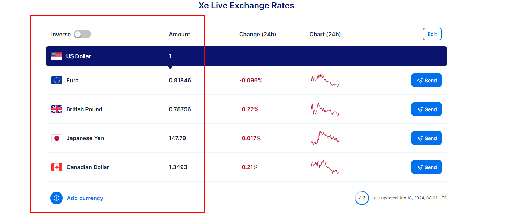

# TODO
(Use normal Redux to manage data and state)

- [ ] Real time conversion no need to click button but use debounce concept to convert after 500ms of typing
- [ ] Add list of top 5 currencies with conversion rate with loader

- [ ] update this list based on last 5 conversions