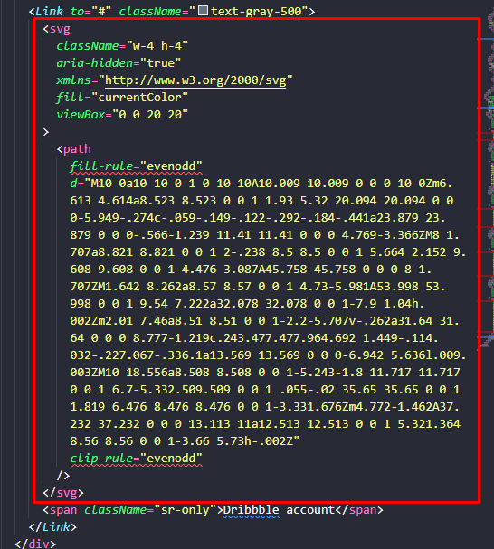
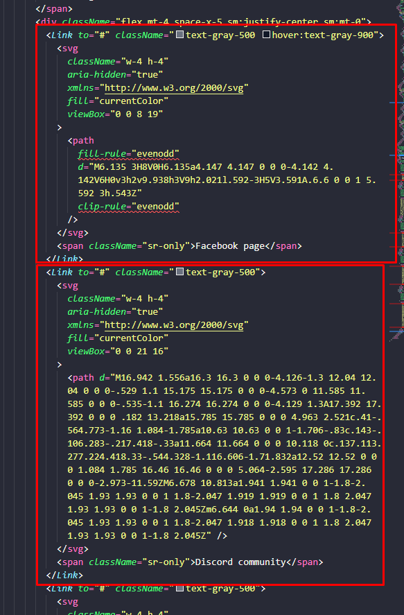
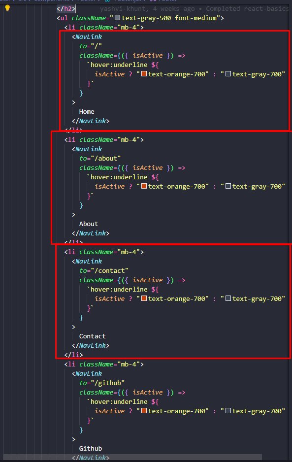

# React + Vite

This template provides a minimal setup to get React working in Vite with HMR and some ESLint rules.

Currently, two official plugins are available:

- [@vitejs/plugin-react](https://github.com/vitejs/vite-plugin-react/blob/main/packages/plugin-react/README.md) uses [Babel](https://babeljs.io/) for Fast Refresh
- [@vitejs/plugin-react-swc](https://github.com/vitejs/vite-plugin-react-swc) uses [SWC](https://swc.rs/) for Fast Refresh

# Questions

- What is difference between Link & NavLink Component?

# Remarks

- When using svg make a component store this in file and use it as component insted of having this whole svg path in main file
  
- Whenever there is similar repeating block of code can make component and use it to have clean code
   
