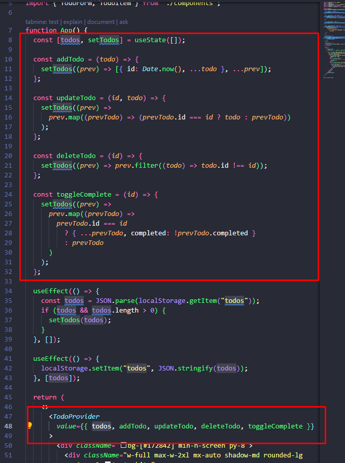
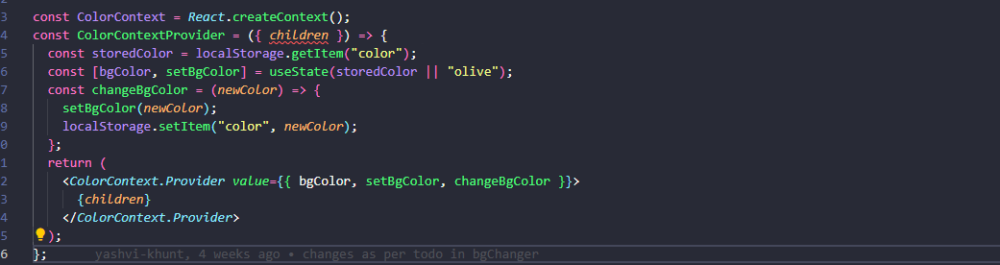
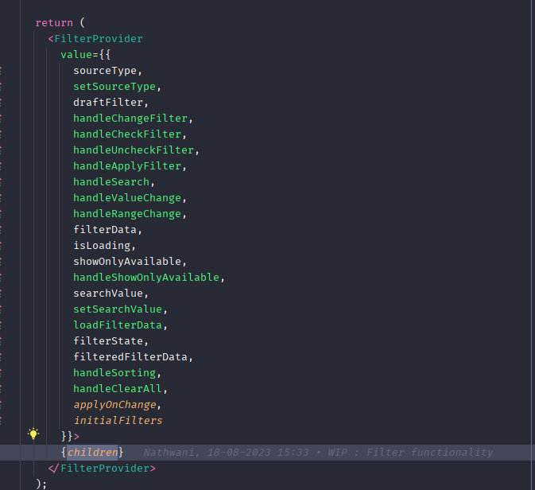
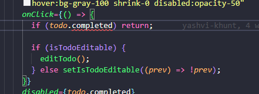
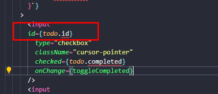

# React + Vite

This template provides a minimal setup to get React working in Vite with HMR and some ESLint rules.

Currently, two official plugins are available:

- [@vitejs/plugin-react](https://github.com/vitejs/vite-plugin-react/blob/main/packages/plugin-react/README.md) uses [Babel](https://babeljs.io/) for Fast Refresh
- [@vitejs/plugin-react-swc](https://github.com/vitejs/vite-plugin-react-swc) uses [SWC](https://swc.rs/) for Fast Refresh

# Remarks

- Insted of having all functions and states in main component we can make a higher order function and wrap the main component with it in higher order component you can define states make all methods and export provider with all values as shown in below code. this wll allow all child component to use state and functions

- Write handler functions outside of component avoide writing inline when function is more than one line

- Give id to checkbox when having list of checkbox

